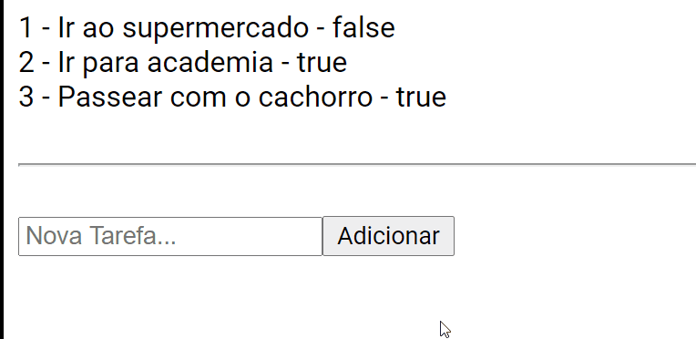

<h1 align="center">Fundamentos React</h1>
 

<h3 align="center"> Listagem simples de tarefas com foco em isolar em um contexto os valores passados para outros componentes. </h3> 

  

# Tópicos 🚀

- ReactJs
- Propriedades
- Listagem
